# STEM - an Altair 8800 File Manager
This project is a file manager for an Altair 8800 running CP/M 2.2.  

By file manager, I mean something like XTreeGold, Midnight Commander, etc.; a text interface based utility to list files on disks and perform operations such as copy, delete, display and rename.  Of course, there are CP/M "built-in" commands to do most of these things, and `PIP` to do the rest, but I miss my days of XTree on DOS.

The program name is `STEM` because CP/M doesn't have subdirectories, so anything with "tree" in the name would be kind of dumb :)

## Status
### Completed items:
+ Loading/listing files on drives `A` to `P`
+ Switching CP/M "User Area"
+ File copy
  + Copy file on same drive, for example, copy `STUFF.TXT` to `STUFF.BAK`.  Both files will be in the current disk, current user area
  + Copy file to another drive, for example, copy `STUFF.TXT` to `B:STUFF.TXT` will copy the file to drive `B` (assuming current disk is not `B`).  One could also rename as part of the copy; for example, `STUFF.TXT` to `C:MORSTUFF.BAK`.
  + Copy file to a different User Area on the current disk
+ File rename
+ File deletion
+ File display; the program will try to determine if the file content is ASCII or binary.  If it is ASCII, it will be displayed as pages of text, if binary it will be displayed as pages of hexdump

### Known issues and limitations
+ Program will load a maximum of 70 files per drive
+ ASCII/Text display pager makes some assumptions about what will fit on a screen.  Screen is assumed to be 80 columns by 24 lines

### TODO
+ Increase file capacity
  + The big thing is that the middle section of screen (file listing) will need to be scrollable independent of the rest of the screen
  + Tagging will need to be refactored, but not a big deal
+ Add file/disk info, such as capacity, utilisation, sizes, etc.  This is part of above item
+ Add compression/decompression using standard ZIP algorithms

This is a work in progress.  As seen in the `TODO`, It is not feature complete.  Contributions are great!  Here are a couple of ways:
+ Try the program out and submit any issues you may find.  Please include as much detail as possible.
+ Fork this repo, do some coding, and submit a PR.  *(A PR that includes any code produced by any kind of LLM/coding agent will be rejected.  Even the most insignificant bit of that crap will be thrown out.  Sorry, my repo, my rules.)*

## About the program
The program was written from scratch in 8080 assembly language.  All file I/O is handled by syscalls to CP/M; because of that, the program *should* work on any computer with an 8080 or Z80 CPU that is running CP/M 2.2, but I really can't guarantee that :/

The main reference materials used in the development were the CP/M 2.2 and Intel 8080 System manuals.  I started writing it using `ED` on an Altair-Duino retro kit, but it got to be a bit too much as the filesize grew over 30K.  The rest was done using the Zed editor, transferring the source file to the computer using `XMODEM`.  Once there, it was assembled and tested/debugged.

Why write a new program in 8080 Assembly by hand in this era?  Because it's been a while since I wrote anything of consequence in Assembly.  Because I find it kind of fun and it keeps my skills sharp.  Also, it's my small way of pushing back against "modern" languages and development where one must download and link 37 libraries to produce a 13MB "Hello World!" program.

I did consider C, a language I have a lot of professional experience with, but in the end went with Assembly.  It was a nice clean toolchain to be able to use just the assembler and `DDT` debugger to produce a program.

When writing the program, I spent a lot of time trying to be sure to accurately and concisely document the code as I went.  My hope is that it helps others who want to learn Assembly.  Skilled Assembly users will see optimizations and shortcuts I could have taken, but I skipped a lot of that in favor of more clarity.

Another reason to use Assembly in the modern era: if you are ever thinking about getting into reverse engineering, security research, malware analysis, or Embedded/IoT/IIoT development you may be exposed to Assembly at some point.  Whether it's decompiled output in Ghidra or reading through a `.lst` file looking for optimizations, having some experience with Assembly will give you a good leg up.

Final note:  **No LLM, coding agent, vibe, or other "AI" crap was or ever will be used in this project.  I have no desire to be around any of that clanker garbage.**

### Building/installation
There are a few ways to get the program:  
* Print out the source listing and type it in by hand just like we did as kids, hand-typing in programs from magazines and books.  While it was a great way to learn, I really don't expect anyone to do that.
* Transfer the source file to either a software Altair emulator, a hardware retro kit, or the real thing if you're lucky enough to have access to one.  There are a variety of ways to do that, see your docs.  
 
Once the `asm` file is on the system:  
Assemble the program using CP/M's `asm` program.  Command line and output would be something like this (drive letters most likely different, etc.):  
```  
C>asm stem.ccb                                                               
CP/M ASSEMBLER - VER 2.0
2237
011H USE FACTOR
END OF ASSEMBLY
```           
*Note - Based on disk sizes, it may be necessary to direct `PRN` output to another drive, something like `asm stem.ccb` which would read asm file from C, output hex to C, and output prn to B*

Then use `load` to create loadable executable image:    
```  
C>load stem                                                                     
                                                                                        
FIRST ADDRESS 0100
LAST  ADDRESS 1E3C
BYTES READ    1D3D
RECORDS WRITTEN 3B  
```   
This process is almost instantaneous on a software-simulated Altair running on modern hardware.  On Altair-Duino hardware with disk I/O set to "real time", the build process will take several minutes!  Grab a coffee and enjoy the Blinkenlights :)

The last way is to download the latest build from the Releases of this repo.  That will be a zip archive with the latest `.com`, `.prn`, and `.hex` files.  The `hex` and `prn` files are included in case you want to use `DDT` to debug and explore program execution. 

## Requirements
The basic requirements are:
* An Altair 8800 computer, a retro kit, or software emulator.  Also an IMSAI and possibly other 8080/Z80 computers running CP/M 2.2.  I have only used an Altair retro clone kit and an emulator, so your mileage may vary.  I would be interested in hearing about experiences with other machines.  
* It should run comfortably in anything with 20KB of RAM or greater (although I have not built it on a machine with less that 64K)
* One or more disk drives (real or logical/virtual/emulated)
* CP/M 2.2, including `ASM.COM` and `LOAD.COM` if building from source
* A display that is VT-100 capable.  The program makes a lot of use of escape sequences to control cursor position and other screen details.
  * The program is written assuming an 80x24 character display.  Using a narrower display will look goofy
  * It works well over a serial link to Linux/MacOS running a command line terminal program like `minicom`.  I have no idea how it runs under Windows.  Last I remember, Windows cmd.exe didn't recognize escape sequences, but maybe it'll work under PuTTY or something like that.

*NOTE - if you see a lot of `[2j` and the screen is a garbled mess, your terminal does not understand escape sequences*

Most of the development has been done an Altair-Duino 8800 Experimenter kit from [Adwater & Stir](https://adwaterandstir.com/altair/).  They produce a great kit that's fun and easy to build and has an excellent online community.  

At times, I used a [docker-based emulator](https://gloveboxes.github.io/Altair-8800-Emulator/); mostly when I was away from my desk where the A-D sits.  It's a solid and easy to use emulator, but I strongly dislike that project's push of vibe coding/AI.  Just my opinion and preference.

## Running the program
From the command line, run `STEM`:  

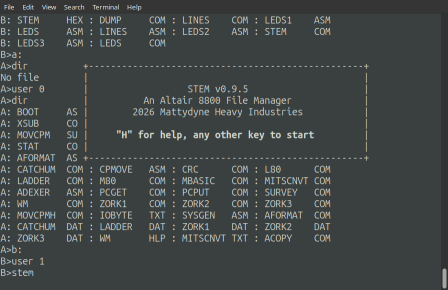

Pressing the `H` key will show the program's help.  There are 3 pages of help information, the first of which is an abbreviated "short" help:

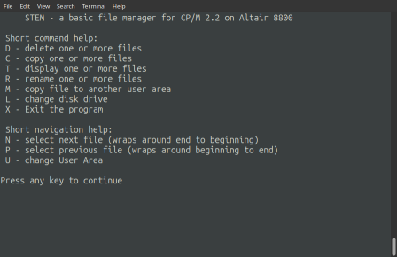

Pressing any key will show the second page of help which describes the screen.  Another key press brings up a bit more detailed information on each command.  Finally, one last keypress will bring up the file listing:

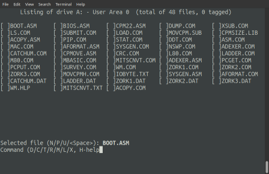

The program divides the screen into 3 sections:
+ Breaking down the top line:
  + `Listing of drive A:` - in this case, this is showing the listing of drive `A:` (obviously)
  + `User Area 0` tells us that these are the files in CP/M user area 0.  CP/M 2.2 doesn't support directories/subdirectories, but CP/M 2.2 introduced "User Areas".  Basically, files can be logically divided into distinct User Areas from 0 to 15.  See CP/M documentation/online for detailed information. (`STEM` makes copying files between user areas a bit easier!)
  + `(total of 48 files, 0 files tagged)` - in this case, the program found 48 files in drive `A:`, user area 0.  No files are currently tagged; more on file tagging below.

+ The middle section shows the actual file listing.  Files are listed in 5 columns, each filename preceded by a placeholder to show tag status:  untagged files have an empty place holder (`[ ]`), tagged files are shown with a capital x (`[X]`).  *There is currently a limitation that only the first 70 files will be listed.*

+ The bottom section consists of 2 lines
  + The first line shows the currently selected file in **BOLD** if your terminal supports it.  
    + File selection is handled by the `N` and `P` keys; these move to the next or previous file in the listing respectively.  If at the first file, `P` will wrap around the last file; if at the last, `N` will wrap around to the first.
    + The `<SPACE>` bar will toggle tag status of the currently selected file
    + `U` will bring up a dialog to ask you to select a different user area to display on the current disk
  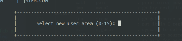
  + The second line lists the available commands:
    + `D` - Delete all tagged files (user will be prompted before deletion)
    + `C` - Copy tagged files (user will be prompted for name of each file)
    + `T` - Display tagged files
    + `R` - Rename tagged files
    + `M` - Copy tagged files to a different User Area on the current disk
    + `L` - "Log" another disk (switch to another disk)
    + `X` - Exit the program 
    + `H` - Display the help information

*Note - commands can be entered in upper or lower case*

### Tagging files 
Commands are performed on "tagged" files.  Pressing the space bar will either "tag" or "untag" the selected file.  For example, 2 files have been "tagged", `STEM.COM` and `STEM.PRN`:  

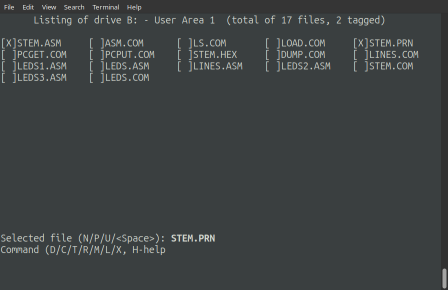

### Deleting files
Once one or more files are tagged, pressing the `D` key.  A dialog will prompt for confirmation of deletion.  Selecting `A` will delete the rest of the tagged files without further prompting:  

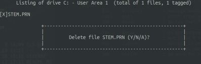

### Copying files
Tagged files will be copied by pressing the `C` key.  A dialog will prompt for confirmation and name for the copies:  

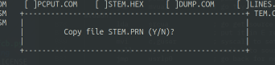

Copying a file to another drive can be acomplished by specifying that drive in the name, for example `C:STEM.PRN` will copy the currently tagged file to the `C:` drive.

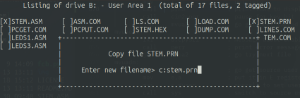

After copying, a dialog will show how many 128KB blocks were copied:

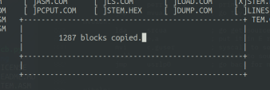

*NOTE - filenames will automatically be converted to uppercase before copying*

### Displaying files
Tagged files will be displayed with the `T` key.  A dialog will prompt for confirmation of display.  ASCII/Text files will be displayed one page at a time:

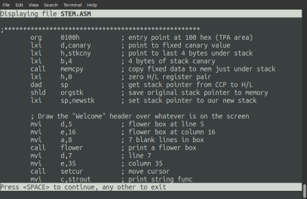  

Binary files will displayed as a hex dump with 256 bytes per page:

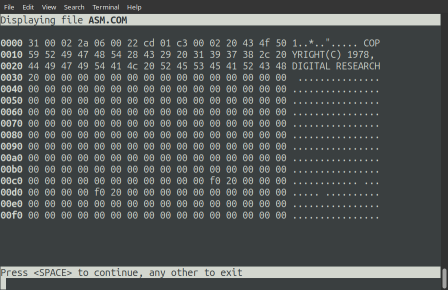

### Renaming files
Tagged files will be renamed with the `R` key.  A dialog will prompt for the new name for each file:  

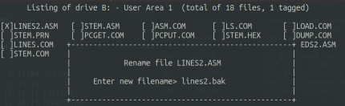

*NOTE - filenames will automatically be converted to uppercase before renaming*

### Copying files to another user area
Tagged files will be copied to another user area with the `M` key.  A dialog will prompt for the target user area number.  A dialog will show progress as each file is copied.

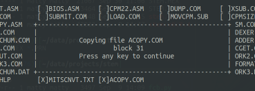

*NOTE - filenames will automatically be converted to uppercase before copying*  
*NOTE - existing files with target name in target user area will be deleted before copy*  

### Logging in to another disk
Changing to another disk, "Logging In" in CP/M parlance, is done with the `L` key.  A dialog will prompt for new disk:

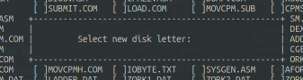
